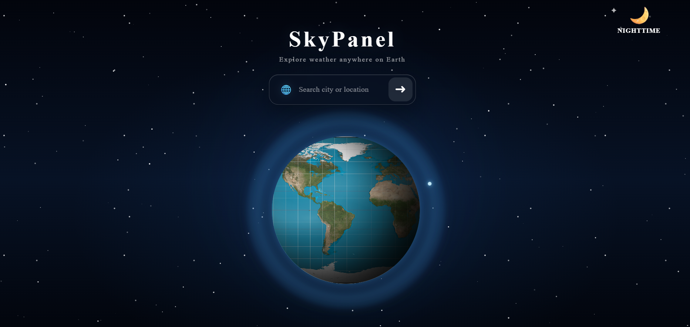
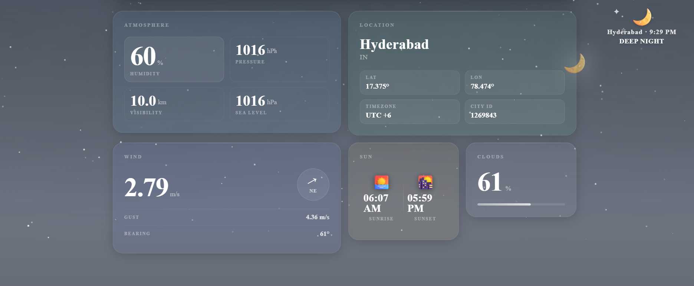
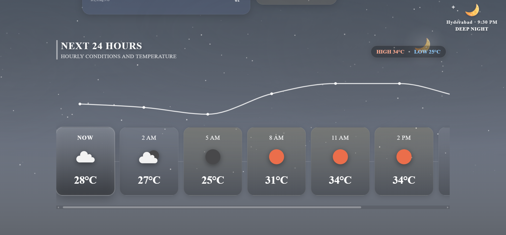
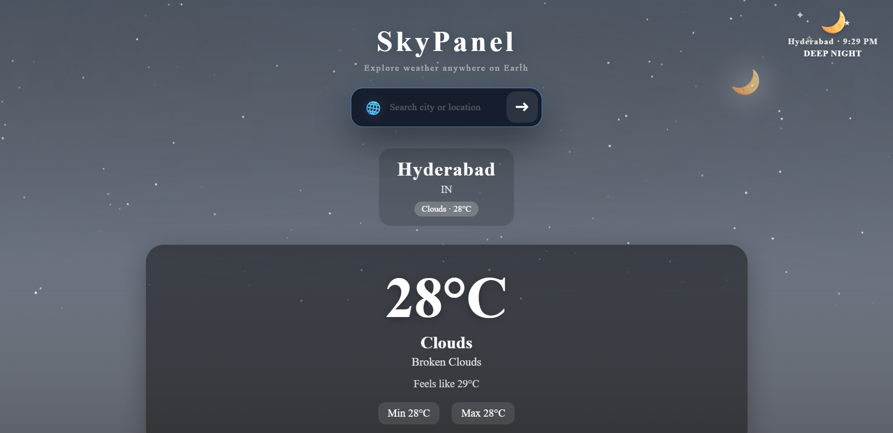
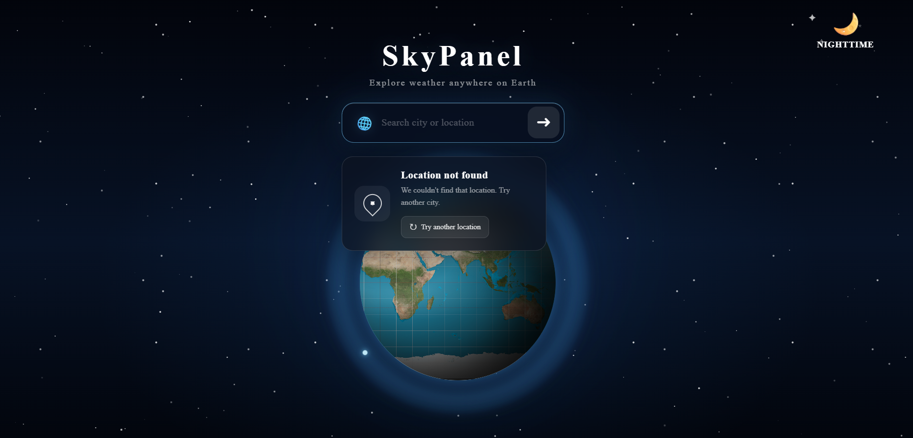

# 🌤️ SkyPanel — Weather Dashboard

SkyPanel is a modern, responsive weather dashboard built with React and Vite. It provides current weather information, a five-day forecast, interactive charts, and an immersive interface featuring animated visual effects and a 3D Earth introduction.

## ✨ Features

- 🌍 **Interactive 3D Earth Intro** — An engaging introduction with Earth-inspired visuals.
- 🔍 **City Weather Search** — Search for a city to view its weather conditions.
- 🌡️ **Current Weather** — View temperature and other available weather information.
- 📊 **Interactive Forecast Charts** — Explore forecast data using Recharts.
- 🗓️ **Five-Day Forecast** — View forecasts at three-hour intervals.
- 🌅 **Sunrise and Sunset** — Display sunrise and sunset times based on the city's timezone.
- 🕒 **Timezone-Aware Local Time** — Show time information for the selected location.
- 🎨 **Dynamic Weather Effects** — Weather-inspired backgrounds and visual effects.
- 📱 **Responsive Design** — A glassmorphism-inspired interface designed for different screen sizes.

## 🖼️ Screenshots

### SkyPanel Interface



### Weather Dashboard



### Forecast Visualization



### Weather Information



### Additional Interface View



## 🛠️ Tech Stack

| Technology | Purpose |
|---|---|
| React 19 | User interface and components |
| JavaScript (ES6+) | Application logic |
| CSS3 | Styling, animations, and responsive layouts |
| Vite 8 | Development server and build tool |
| Recharts | Interactive weather charts |
| OpenWeather API | Current weather and forecast data |
| ESLint | Code quality and linting |

## 🚀 Getting Started

Follow these steps to run SkyPanel locally.

### Prerequisites

- Node.js and npm
- An OpenWeather API key

### 1. Clone the repository

```bash
git clone https://github.com/JulooruSaiteja/SkyPanel.git
cd SkyPanel
```

### 2. Install dependencies

```bash
npm install
```

### 3. Configure the API key

Create a `.env` file in the project root and add your OpenWeather API key:

```env
VITE_OPENWEATHER_API_KEY=your_openweather_api_key
```

Replace `your_openweather_api_key` with your actual API key.

You can obtain an API key from [OpenWeather](https://openweathermap.org/api).

**Important:** Never commit your real `.env` file or expose your API key in public source code. Ensure `.env` is included in `.gitignore`. The `VITE_` prefix makes the variable available to client-side code, so it should not be treated as a secret suitable for privileged API access.

### 4. Start the development server

```bash
npm run dev
```

Open the local URL printed in your terminal to view the application.

## 📦 Production Build

Create an optimized production build:

```bash
npm run build
```

Preview the production build locally:

```bash
npm run preview
```

## 🌐 API Integration

SkyPanel uses the OpenWeather API to retrieve weather information.

| Endpoint | Purpose |
|---|---|
| [Current Weather API](https://openweathermap.org/current) | Retrieves current weather conditions |
| [5 Day / 3 Hour Forecast API](https://openweathermap.org/forecast5) | Retrieves forecast data at three-hour intervals |

The application uses the metric unit system for temperature where configured.

## 📁 Project Structure

```text
SkyPanel/
├── SkyPanel_Images/
│   ├── SkyPanel1.png
│   ├── SkyPanel2.png
│   ├── SkyPanel3.png
│   ├── SkyPanel4.png
│   └── SkyPanel5.png
├── src/
│   ├── App.jsx
│   ├── App.css
│   ├── EarthIntro.jsx
│   ├── EarthIntro.css
│   ├── Forecast.jsx
│   ├── Forecast.css
│   ├── HeaderDecoration.jsx
│   ├── HeaderDecoration.css
│   ├── InfoBox.jsx
│   ├── InfoBox.css
│   ├── SearchBox.jsx
│   ├── SearchBox.css
│   ├── WeatherBackground.jsx
│   ├── WeatherBackground.css
│   ├── timeUtils.js
│   ├── index.css
│   └── main.jsx
├── .env.example
├── .gitignore
├── eslint.config.js
├── index.html
├── package.json
├── package-lock.json
├── vite.config.js
└── README.md
```

## 🔮 Future Improvements

- 📍 Weather based on the user's current location
- 🌡️ Celsius and Fahrenheit temperature toggle
- ⭐ Favorite cities
- 🌫️ Air Quality Index (AQI) information
- ☀️ UV index information

## 👨‍💻 Author

**Julooru Saiteja**

---